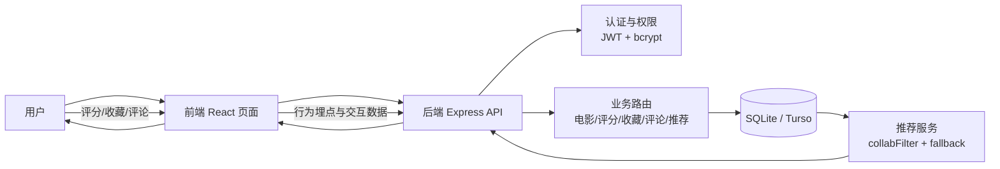

# 影视推荐系统：项目整体思路与算法流程图

本文基于当前仓库代码（`frontend + backend`）整理项目的整体实现思路，并给出核心推荐算法流程图，便于汇报、答辩和后续维护。

## 1. 项目整体思路（从“用户操作”到“推荐结果”）

本项目采用前后端分离架构：

- **前端（React + Vite）**：负责页面展示、交互、调用后端 API
- **后端（Node.js + Express）**：负责认证、业务逻辑、推荐计算、数据聚合
- **数据库（SQLite/sql.js 或 Turso）**：存储用户、电影、评分、收藏、评论、标签等数据

整体闭环思路如下：

1. 用户在前端进行浏览、评分、收藏、评论等操作
2. 后端将行为数据写入数据库（如 `ratings`、`favorites`、`comments`）
3. 推荐服务读取用户历史行为，构建用户-电影偏好矩阵
4. 对行为使用**时间衰减**（最近行为权重更高）
5. 使用协同过滤得到候选电影，再融合标签内容分形成混合推荐
6. 若用户冷启动或结果不足，走兜底策略（个性化规则/热门推荐）
7. 前端展示推荐结果，并展示推荐理由标签（如“混合推荐”“热门推荐”）
8. 用户继续反馈，系统形成持续迭代优化闭环

---

## 2. 系统架构流程图（全项目思路）



---

## 3. 推荐算法主流程图（核心）

对应后端核心实现：

- `backend/src/routes/recommendations.js`
- `backend/src/services/collabFilter.js`
- `backend/src/services/recommendFallback.js`

```mermaid
flowchart TD
  A[请求推荐接口\nGET /api/recommendations] --> B{scene 是否 similar?}

  B -- 否/默认 home_personalized --> C[读取用户交互\nratings + favorites + comments]
  C --> D[构建时间衰减矩阵\nweight = value * exp(-λ*days)]
  D --> E{交互数 >= 3 且相似用户足够?}

  E -- 是 --> F[用户协同过滤\n得到 CF 候选集]
  F --> G[计算用户标签偏好\n评分>=3.5 + 收藏]
  G --> H[融合重排\nS = α*CF_norm + β*TagScore]
  H --> I[附加推荐理由标签\nhybrid/cf]

  E -- 否 --> J[冷启动/兜底推荐\n个性化规则或热门]
  J --> I

  B -- 是 similar --> K[相似电影推荐\n喜欢这部的人也喜欢]
  K --> L{结果为空?}
  L -- 否 --> I
  L -- 是 --> M[内容相似兜底\n同分类/同标签]
  M --> N{仍为空?}
  N -- 否 --> I
  N -- 是 --> O[热门推荐兜底]
  O --> I

  I --> P[返回前端展示]
```

---

## 4. 核心算法说明（简版）

### 4.1 时间衰减

对用户行为按时间做指数衰减：

- 公式：`w = v * exp(-λ * Δt)`
- `v`：行为基础分值（评分原值、收藏=5、评论=3.5）
- `Δt`：距离当前的天数
- `λ`：`RECOMMEND_TIME_LAMBDA`（默认 0.012）

作用：让系统更关注用户“近期兴趣”，降低过时偏好的影响。

### 4.2 混合推荐（CF + 标签内容）

协同过滤候选集得到后，再与标签匹配分融合：

- 公式：`S = α' * CF_norm + β' * TagScore`
- `CF_norm`：协同过滤分数归一化
- `TagScore`：用户标签偏好与候选电影标签重合度
- 可调参数：`RECOMMEND_CF_ALPHA`、`RECOMMEND_CONTENT_BETA`

作用：缓解数据稀疏、提升结果可解释性与稳定性。

---

## 5. 一句话总结（可直接用于答辩）

本项目以“**行为驱动 + 协同过滤为主 + 内容标签增强 + 冷启动兜底**”为核心策略，形成从用户交互到推荐更新的闭环系统，实现了可落地、可解释、可扩展的电影个性化推荐流程。
